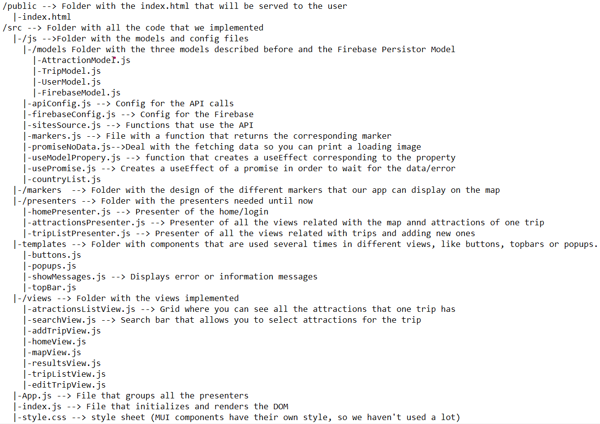

# Trip Organizor

**Authors:**

- [Adrià Torruella](https://gits-15.sys.kth.se/adriapt)
- [Fernando Codony](https://github.com/fergascod)
- [Paulo Hernandez](https://github.com/paulohj)
- [Susana Monteiro](https://github.com/susmonteiro)

### Live Demo:

You can find a demo of our project here: https://triporganizor.herokuapp.com

### Getting Started:

To get started, firstly install all the necessary dependencies

`> npm install`

Then, in the project directory, you can run

``> npm start`

Open http://localhost:3000 to view the app in development mode in the browser

### Short description

We want to make an app that helps you visualize all the places you want to visit when travelling so you can organize them easily. The user will be able to create different travel lists and inside each list they can add places to visit. These places can be categorized with diferent topics like Restaurants, Museums, Sightseeing, etc. and they will have different colours. The user will be able to see marks representing each one of the elements they added, with its associated colour. The user will be able to aply filters, so only the desired elements are shown in the map.

###

### What we have done so far:

1. Implemented Views:

- Trip Selector View
- Add Trip View
- Map View
- Search attraction Bar View
- Attractions List View

2. Implemented models. Since The model was complex (A User can have different trips and each trip has several attractions) and we wanted to have methods for the users, trips and attractions, we implemented them in three diferent Models, however, the model that keeps the state is the more general one, the User Model.

3. Navigation using Routers

4. Presenters that display views mentioned before

5. Persistent database using Firebase

6. API calls and using their info

### What we still have to do:

1. Complete all the views

2. Add some functionalities like making favourite attractions or deleating them.

3. Style all the views (And all the MUI components)

4. Fix bugs and problems when grouping everything

5. Allow login and authentication

### Project File Structure:

